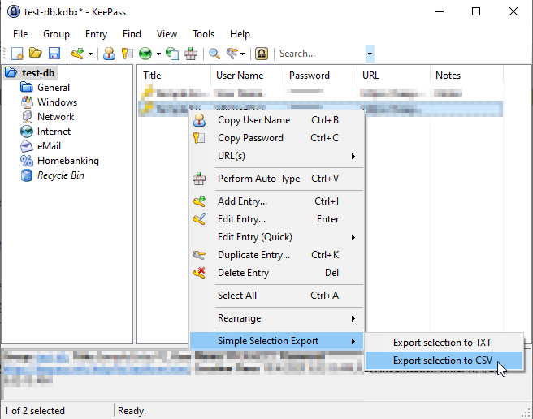

# SimpleSelectionExport

SimpleSelectionExport is a [KeePass2](https://keepass.info) plugin which allows you to export basic entry 
information to flat text files. It's useful when you want to send a quick overview of an arbitrary set of 
entries -- selected from the main window -- to parties who are not using KeePass.

